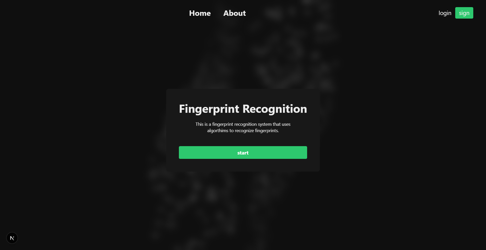

# 🚀 fingerprint-system App

## 📦 Installation

```bash
git clone https://github.com/them7d/fingerprint-system.git
cd fingerprint-system
npm install
cp .env.example .env

```

## Getting Started

First, run the development server:

```bash
npm run dev
# or
yarn dev
# or
pnpm dev
# or
bun dev
```

Open [http://localhost:3000](http://localhost:3000) with your browser to see the result.

## screen Shot


